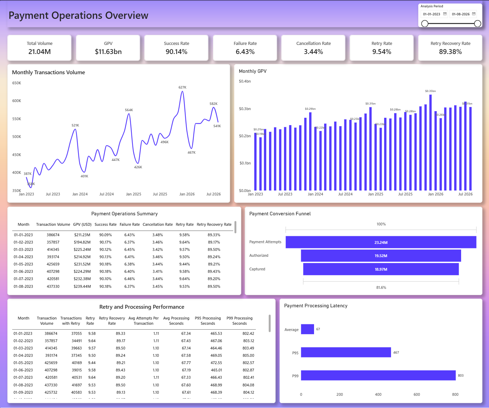
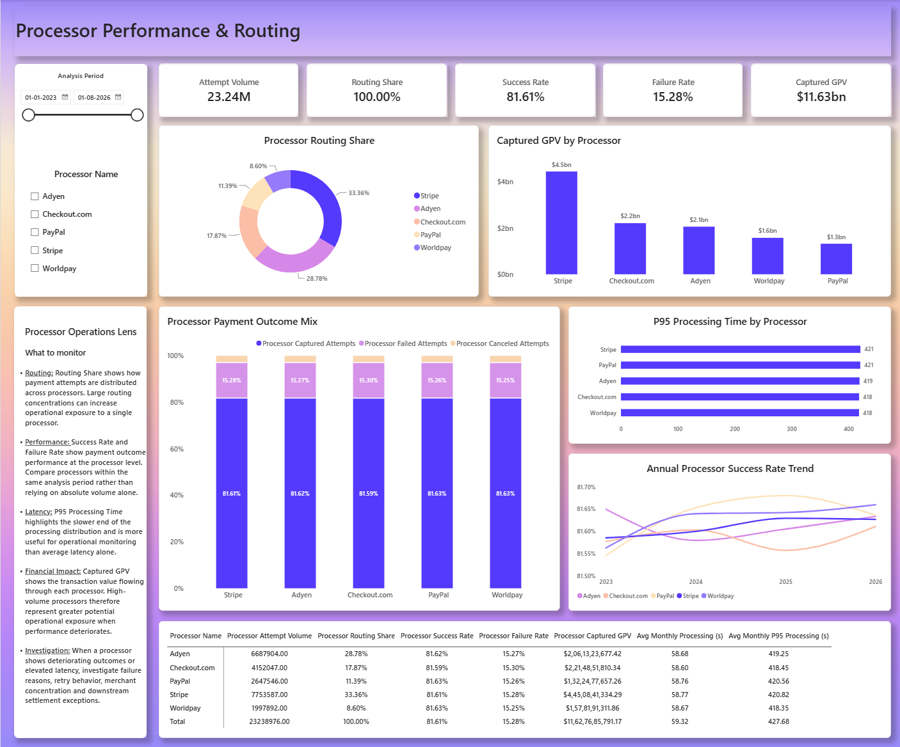
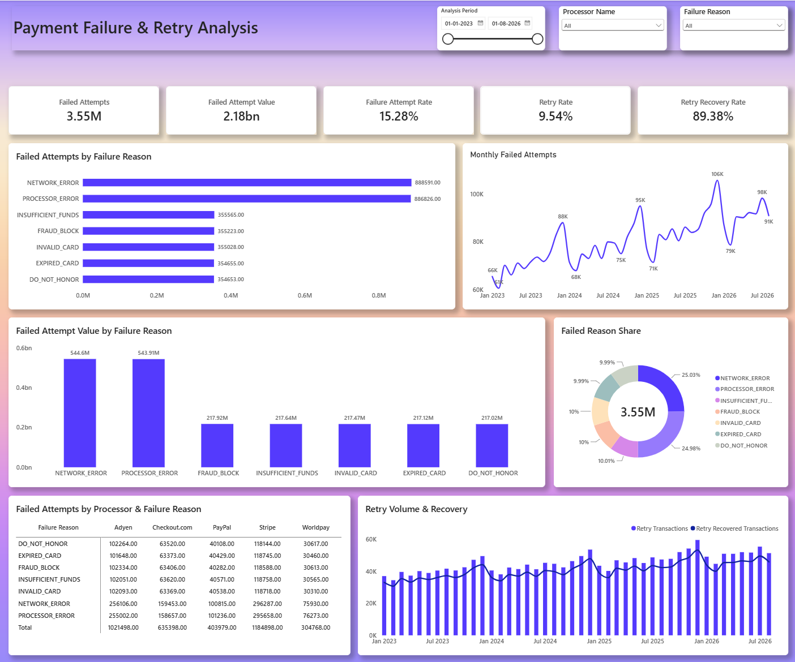
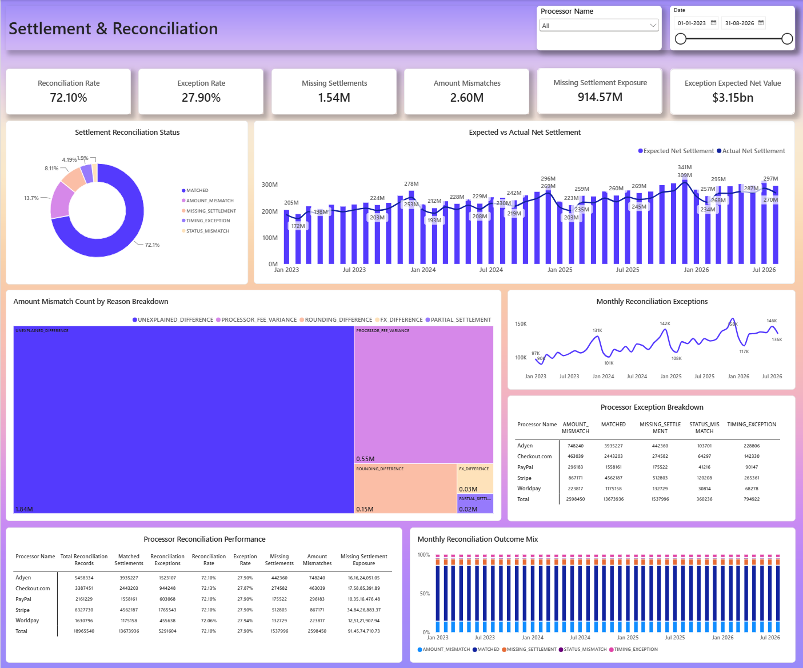
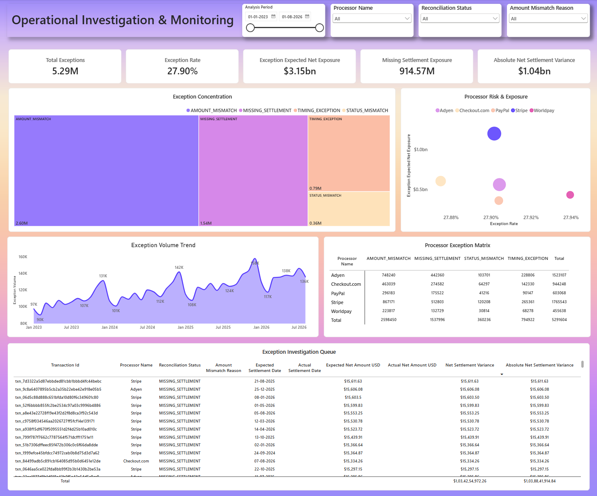

# Payment Operations Analysis

### Payment conversion, failure recovery, processor performance and settlement reliability across the payment lifecycle.

**Role:** Payment Operations Data Analyst  
**Domain:** Payments / FinTech  
**Data Environment:** Synthetic payment operations environment  
**Tools:** PostgreSQL · Python · SQL · Power BI · DAX

---

## Executive Summary

This project analyzes a simulated digital commerce payment environment to understand operational performance from **payment attempt through capture, settlement and reconciliation**.

The analysis focuses on five business questions:

- Are payment attempts successfully reaching capture?
- What is driving payment failures and retries?
- How are payment processors performing?
- Are captured payments settling correctly?
- Where should Operations investigate first?

### Key Metrics

| Metric | Result |
|---|---:|
| Transactions | **21.04M** |
| Payment Attempts | **23.24M** |
| Captured Payments | **18.97M** |
| Attempt-to-Capture Conversion | **81.59%** |
| Retry Recovery Rate | **89.38%** |
| Reconciliation Rate | **72.10%** |
| Reconciliation Exception Rate | **27.90%** |
| Missing Settlements | **1.54M** |
| Missing Settlement Exposure | **$914.57M** |

---

## Business Context

This project simulates a digital commerce platform processing customer payments through multiple external payment processors.

I approached the analysis as a **Payment Operations Data Analyst**, focusing on three operational areas:

| Stakeholder | Focus |
|---|---|
| **Payments Operations** | Conversion, failures, retries and processing latency |
| **Processor Operations** | Routing, processor performance and latency |
| **Finance / Settlement Operations** | Settlement reliability, reconciliation and financial exposure |

The analysis follows the payment lifecycle from initial attempt through downstream settlement:

### Payment lifecycle

```text
Payment Attempt
      ↓
Authorization
      ↓
Capture
      ↓
Expected Settlement
      ↓
Processor Settlement
      ↓
Reconciliation
```


## 01 — Payment Operations

### 81.59% of payment attempts reach capture — the largest funnel loss occurs before authorization

**23.24M payment attempts → 19.52M authorized → 18.97M captured**



### What the data shows

- **83.95% authorization rate** — 19.52M of 23.24M payment attempts reached authorization.
- **97.18% capture rate** — once authorized, 18.97M attempts reached capture.
- **81.59% overall attempt-to-capture conversion** — the largest funnel loss occurs before authorization.
- **9.54% of transactions experienced retries**, with **89.38% of retried transactions eventually recovering**.
- Processing latency has a long tail: **67s average, 467s at P95 and 803s at P99**.

### Operational implication

**The largest conversion gap occurs before authorization, while post-authorization capture remains relatively strong. Failure reasons, processor performance and retry behavior are therefore the next areas to investigate for understanding the authorization drop.**

---

## 02 — Processor Operations

### Two processors handle 62.14% of payment attempts — creating concentrated operational exposure

**Stripe 33.36% + Adyen 28.78% = 62.14% of total payment-attempt volume**



### What the data shows

- **Stripe handles 33.36% of payment attempts**, making it the largest processor by routing volume.
- **Adyen handles 28.78%**, bringing the combined routing share of the two largest processors to **62.14%**.
- The remaining 37.86% of attempts are distributed across Checkout.com, PayPal and Worldpay, providing additional routing capacity across the processor network.
- **Captured GPV of $11.63B** represents the financial value flowing through the processor network, making processor performance relevant beyond transaction volume alone.
- **P95 processing time** highlights the slower end of the processing distribution and provides a better operational signal than average latency alone.
- The annual processor performance view helps identify whether differences in payment outcomes persist over time rather than relying on a single-period snapshot.

### Operational implication

**Processor routing is not only a volume decision — it determines where operational and financial exposure is concentrated. When payment outcomes or processing latency deteriorate, the investigation should compare processor performance, routing concentration, failure reasons and downstream settlement exceptions.**

---

## 03 — Failure & Retry Analysis

### 3.55M payment attempts fail — but retries recover 89.38% of retried transactions

**3.55M failed attempts → 15.28% failure rate → 89.38% retry recovery**



### What the data shows

- **3.55M payment attempts failed**, representing a **15.28% failure rate** across all payment attempts.
- **9.54% of transactions experienced retries**, indicating that a meaningful portion of payment journeys required additional attempts.
- **89.38% of retried transactions eventually recovered**, showing that retries recover a large share of initially unsuccessful payment journeys.
- Failure reasons provide the first layer of diagnosis, distinguishing issues such as **insufficient funds, processor errors, fraud blocks and network-related failures**.
- The processor-level failure view helps identify whether failures are concentrated within specific processors or failure categories.
- **Failed attempt value of $2.18B** represents the transaction value associated with failed attempts and provides a financial dimension to the operational failure volume.

### Operational implication

**Failure volume alone does not indicate customer impact. The key operational question is which failures are recoverable through retries and which represent persistent payment problems. Failure reason, processor and retry behavior should therefore be analyzed together to distinguish recoverable failures from issues requiring processor or payment-method investigation.**

---

## 04 — Settlement & Reconciliation

### 72.10% of captured payments reconcile successfully — $3.15B of expected net value requires exception handling

**18.97M captured payments → 13.67M matched → 5.29M exceptions**



### What the data shows

- **13.67M captured payments matched successfully**, representing a **72.10% reconciliation rate**.
- **5.29M captured payments require exception handling**, representing **27.90% of the reconciliation population**.
- **1.54M settlements are missing**, representing **$914.57M of expected net settlement value** that has no corresponding processor settlement entry.
- **2.60M records contain amount mismatches**, making amount variance the largest reconciliation exception category by volume.
- Exception records represent $3.15B of expected net settlement value, providing a financial measure of the operational exposure requiring investigation.
- Processor-level reconciliation analysis helps identify where exception volume and expected settlement exposure are concentrated.

### Operational implication

**A captured payment is not the end of the financial lifecycle. The reconciliation layer verifies whether the expected settlement actually arrived, arrived on time and for the expected amount. Missing settlements and amount mismatches therefore require investigation at both the transaction and processor level, with financial exposure used to prioritize operational follow-up.**

---

## 05 — Operational Investigation & Monitoring

### 5.29M reconciliation exceptions can be prioritized by exception type, processor and financial exposure

**5.29M exceptions → $3.15B expected net exposure → transaction-level investigation queue**



### What the data shows

- **5.29M reconciliation exceptions** require investigation across amount mismatches, missing settlements, timing exceptions and status mismatches.
- **Amount mismatches account for 2.60M exceptions**, making them the largest exception category by volume.
- **Missing settlements account for 1.54M exceptions** and represent **$914.57M of expected net settlement exposure**.
- The exception population represents **$3.15B of expected net settlement value**, allowing operational teams to consider both exception volume and financial exposure when prioritizing investigations.
- Processor-level analysis provides a way to identify where exception volume and exposure are concentrated across the payment network.
- The transaction-level investigation queue connects the exception classification to the underlying payment, showing expected versus actual settlement dates and amounts for follow-up.

### Operational implication

**Exception monitoring becomes actionable when aggregate reconciliation metrics can be traced back to individual transactions. The investigation queue provides that bridge, allowing operations teams to identify the exception type, quantify the financial variance, understand the processor involved and prioritize the appropriate follow-up.**

The workflow moves from:

```text
Exception Population
        ↓
Processor
        ↓
Exception Type
        ↓
Time Period
        ↓
Transaction
        ↓
Expected vs Actual Settlement
```

# Stakeholder Actions

| Team | Action |
|---|---|
| **Payments Operations** | Investigate unrecovered retries by failure reason and processor. |
| **Processor Operations** | Monitor processor outcomes and P95 latency alongside routing share and GPV. |
| **Finance / Settlement Operations** | Prioritize reconciliation exceptions using financial exposure, exception type, processor and timing. |

These recommendations are intended as **next-step investigation areas**, not conclusions about root cause.

# Technical Stack

**PostgreSQL · Python · SQL · Power BI · DAX**

The project uses synthetic payment data to simulate payment attempts, payment events, processor activity, settlements and reconciliation workflows.

The technical implementation supports the analytical workflow through data generation, loading, reconciliation, analytical SQL and Power BI reporting.

> **The technical implementation is intentionally kept secondary to the business analysis and operational findings.**

---

## Data Scope

This project uses **synthetic data created for portfolio and analytical development purposes**. It does not contain real customer payment information, production processor data or confidential company information.
